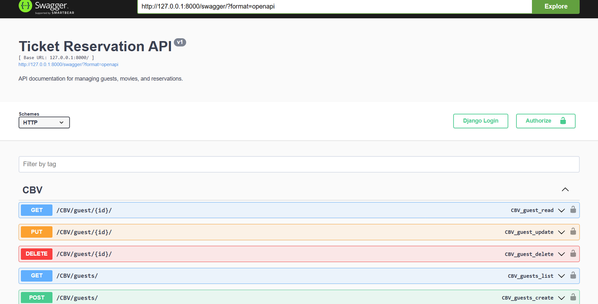
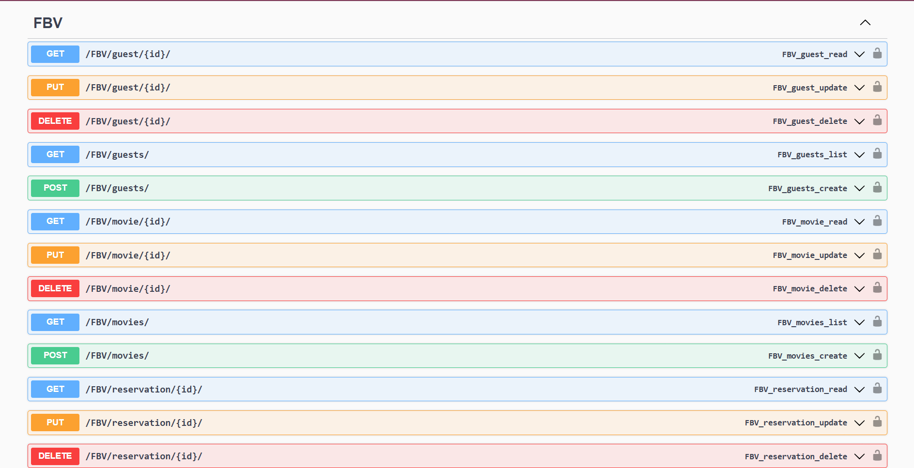
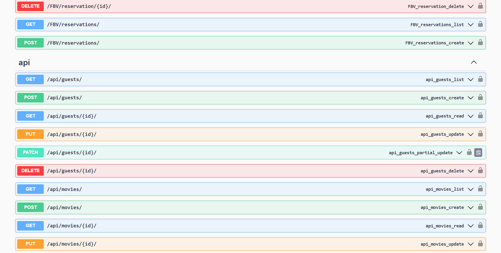
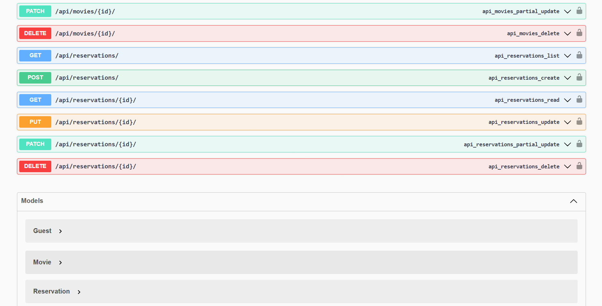

# CinemaTicketsReservation-API

This project is a Cinema Tickets Reservation API built using Django Rest Framework. It demonstrates various features and functionalities of Django Rest Framework, including different types of views (Function-Based Views, Class-Based Views, and ViewSets), and operations like GET, POST, PUT, and DELETE. The project also includes API documentation using Swagger and ReDoc.

## Features

- **Models**: Defines models for Movie, Guest, and Reservation.
- **Serializers**: Serializes the models for API responses.
- **Views**: Implements different types of views:
    - Function-Based Views (FBV)
    - Class-Based Views (CBV)
    - ViewSets
- **Operations**: Supports various operations:
    - GET: Retrieve data
    - POST: Create new data
    - PUT: Update existing data
    - DELETE: Remove data
- **Filtering and Searching**: Implements filtering and searching for reservations by movie title.
- **API Documentation**: Provides API documentation using Swagger and ReDoc.

## Endpoints

### Function-Based Views (FBV)

- **Guests**:
    - `GET /FBV/guests/`: List all guests
    - `POST /FBV/guests/`: Create a new guest
    - `GET /FBV/guest/<int:pk>/`: Retrieve a guest by ID
    - `PUT /FBV/guest/<int:pk>/`: Update a guest by ID
    - `DELETE /FBV/guest/<int:pk>/`: Delete a guest by ID

- **Movies**:
    - `GET /FBV/movies/`: List all movies
    - `POST /FBV/movies/`: Create a new movie
    - `GET /FBV/movie/<int:pk>/`: Retrieve a movie by ID
    - `PUT /FBV/movie/<int:pk>/`: Update a movie by ID
    - `DELETE /FBV/movie/<int:pk>/`: Delete a movie by ID

- **Reservations**:
    - `GET /FBV/reservations/`: List all reservations
    - `POST /FBV/reservations/`: Create a new reservation
    - `GET /FBV/reservation/<int:pk>/`: Retrieve a reservation by ID
    - `PUT /FBV/reservation/<int:pk>/`: Update a reservation by ID
    - `DELETE /FBV/reservation/<int:pk>/`: Delete a reservation by ID

### Class-Based Views (CBV)

- **Guests**:
    - `GET /CBV/guests/`: List all guests
    - `POST /CBV/guests/`: Create a new guest
    - `GET /CBV/guest/<int:pk>/`: Retrieve a guest by ID
    - `PUT /CBV/guest/<int:pk>/`: Update a guest by ID
    - `DELETE /CBV/guest/<int:pk>/`: Delete a guest by ID

### ViewSets

- **Guests**:
    - `GET /api/guests/`: List all guests
    - `POST /api/guests/`: Create a new guest
    - `GET /api/guests/<int:pk>/`: Retrieve a guest by ID
    - `PUT /api/guests/<int:pk>/`: Update a guest by ID
    - `DELETE /api/guests/<int:pk>/`: Delete a guest by ID

- **Movies**:
    - `GET /api/movies/`: List all movies
    - `POST /api/movies/`: Create a new movie
    - `GET /api/movies/<int:pk>/`: Retrieve a movie by ID
    - `PUT /api/movies/<int:pk>/`: Update a movie by ID
    - `DELETE /api/movies/<int:pk>/`: Delete a movie by ID

- **Reservations**:
    - `GET /api/reservations/`: List all reservations
    - `POST /api/reservations/`: Create a new reservation
    - `GET /api/reservations/<int:pk>/`: Retrieve a reservation by ID
    - `PUT /api/reservations/<int:pk>/`: Update a reservation by ID
    - `DELETE /api/reservations/<int:pk>/`: Delete a reservation by ID
    - **Filtering and Searching**:
        - `GET /api/reservations/?movie__title=<title>`: Filter reservations by movie title
        - `GET /api/reservations/?search=<title>`: Search reservations by movie title

## API Documentation

- **Swagger**: Available at `/swagger/`
  
  
  
- 
- **ReDoc**: Available at `/redoc/`

## Setup

1. Clone the repository.
2. Install the required dependencies.
3. Run the Django development server.
4. Access the API endpoints and documentation.

## License

This project is licensed under the MIT License.